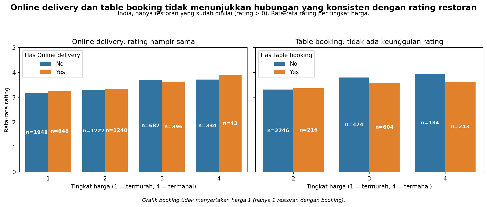
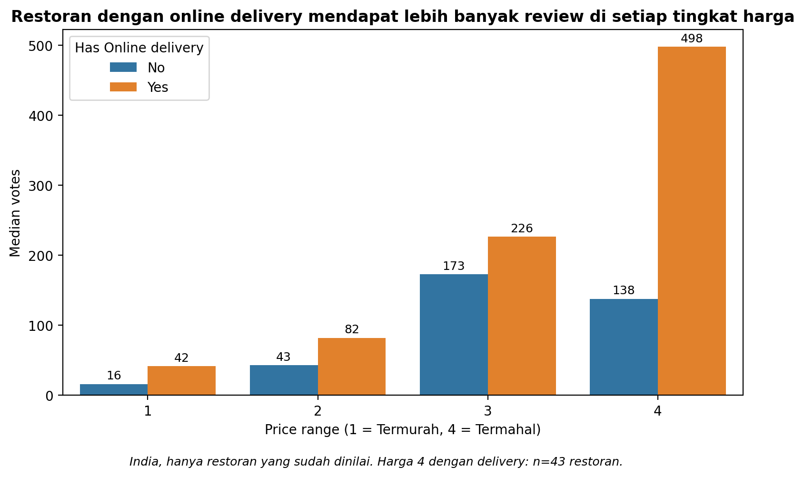
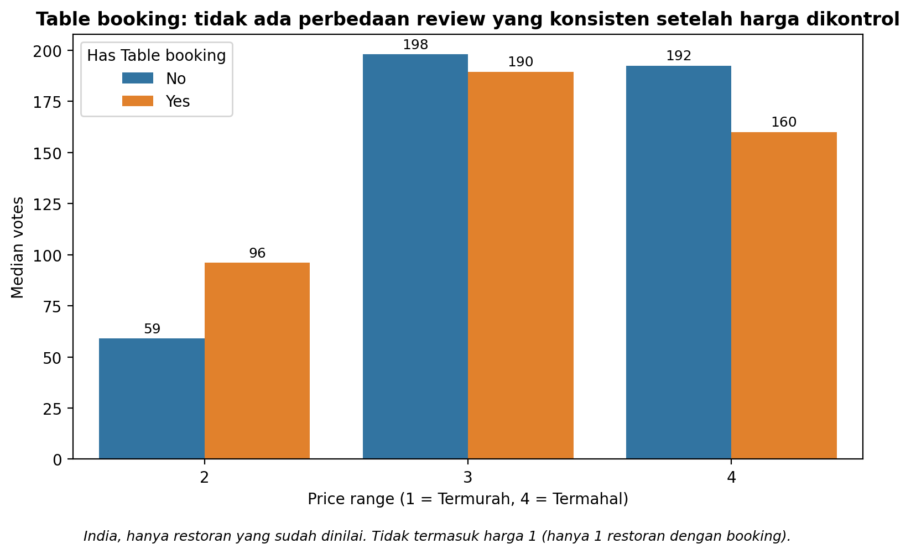

# Apakah Online Delivery dan Table Booking Meningkatkan Rating Restoran?

Analisis data restoran Zomato di India dengan kontrol tingkat harga, dibuat dengan Python (pandas, seaborn, matplotlib).

## Pertanyaan Bisnis

Seorang pemilik restoran ingin rating yang lebih tinggi. Apakah restoran yang menyediakan **online delivery** atau **table booking** punya rating lebih tinggi dibanding yang tidak?

## Ringkasan

- Perbandingan mentah membuat kedua fitur tampak menaikkan rating. **Efek itu sebagian besar hilang** setelah restoran yang belum dinilai dibuang dan tingkat harga dikontrol.
- **Tingkat harga (price range)** adalah faktor yang paling berkaitan dengan rating (sekitar 3,2 di harga 1 hingga 3,7-3,9 di harga 4).
- **Online delivery** berkaitan dengan **lebih banyak ulasan** (median votes lebih tinggi) di setiap tingkat harga. Table booking tidak, setelah harga dikontrol.

## Dataset

- Sumber: Zomato Restaurant Dataset di Kaggle: `<tambahkan link dataset Kaggle>`
- 9.551 restoran, 21 kolom, dari beberapa negara
- Sekitar 90,6% restoran berada di India (country code 1), sehingga analisis dibatasi ke India agar perbandingannya adil

## Pendekatan

1. **Pemeriksaan fitur.** `Is delivering now` (hanya 34 "Yes") dan `Switch to order menu` (semuanya "No") tidak bisa membedakan restoran, sehingga tidak dipakai.
2. **Kualitas data.** `Cuisines` punya 9 nilai kosong (tidak dipakai di analisis ini). Tidak ada Restaurant ID yang duplikat. Sebanyak 2.148 restoran berating 0, yang artinya "Not rated" (belum dinilai), bukan restoran buruk, jadi dibuang dari perbandingan rating.
3. **Cakupan.** Hanya India dan hanya restoran yang sudah dinilai: **6.513 restoran**.
4. **Kontrol harga.** Restoran dengan booking menumpuk di tingkat harga yang lebih tinggi, dan tingkat harga yang lebih tinggi memang ratingnya lebih tinggi. Karena itu perbandingan dilakukan *di dalam* tiap tingkat harga.
5. **Dua metrik.** Rata-rata rating (kepuasan) dan median votes (popularitas). Votes sangat miring ke kanan, jadi dipakai median.

## Temuan Utama

### 1. Rating: tidak ada hubungan yang konsisten dengan kedua fitur

Selisih rata-rata rating (Yes dikurangi No) di dalam tiap tingkat harga:

| Price range | Online delivery | Table booking |
|---|---|---|
| 1 | +0,09 | n/a (hanya 1 restoran) |
| 2 | +0,03 | +0,05 |
| 3 | -0,08 | -0,20 |
| 4 | n/a (n=43) | -0,31 |

Selisihnya kecil dan arahnya campur. Di harga 3-4, restoran **tanpa** booking justru sedikit lebih tinggi ratingnya.

### 2. Votes: delivery berkaitan dengan lebih banyak ulasan

Median votes (No / Yes):

| Price range | Online delivery | Table booking |
|---|---|---|
| 1 | 16 / 41,5 | n/a |
| 2 | 43 / 82 | 59 / 96 |
| 3 | 173 / 226,5 | 198 / 189,5 |
| 4 | 138 / 498 (n=43) | 192,5 / 160 |

Online delivery punya median votes lebih tinggi di semua tingkat harga. Table booking hanya unggul di harga 2.

### 3. Kenapa angka mentah menyesatkan

- Restoran yang belum dinilai (rating 0) kebanyakan restoran tanpa fitur-fitur ini, sehingga menarik rata-rata kelompok "No" ke bawah.
- Restoran dengan table booking kebanyakan berada di harga 3-4, yang memang ratingnya lebih tinggi (efek yang mirip Simpson's paradox).

## Rekomendasi

Menambah delivery atau booking kemungkinan tidak akan menaikkan rating dengan sendirinya. Delivery bisa membantu visibilitas lewat lebih banyak ulasan, tetapi ini hanya hubungan (asosiasi), bukan bukti sebab-akibat. Untuk memastikan efeknya pada restoran tertentu, pantau rating dan votes restoran itu sebelum dan sesudah fitur diaktifkan.

## Keterbatasan

- Data observasional: hasilnya menunjukkan hubungan, bukan sebab-akibat.
- Kota belum dikontrol, padahal lokasi bisa memengaruhi votes.
- Tidak ada uji signifikansi, jadi selisih kecil tidak boleh dibaca sebagai perbedaan nyata.
- Kelompok kecil dibuang atau diberi catatan: table booking di harga 1 (n=1), online delivery di harga 4 (n=43).
- Hasil hanya berlaku untuk India.
- Umur restoran tidak ada di data dan bisa memengaruhi votes.

## Isi Repositori

- `zomato-restaurant-features-vs-ratings.ipynb`: notebook analisis lengkap
- `README.md`: file ini

## Tools

Python, pandas, NumPy, seaborn, matplotlib. Dikerjakan di Kaggle Notebook.

## Notebook

Notebook Kaggle: https://www.kaggle.com/datasets/srisyra02/zomato-market-analysis
